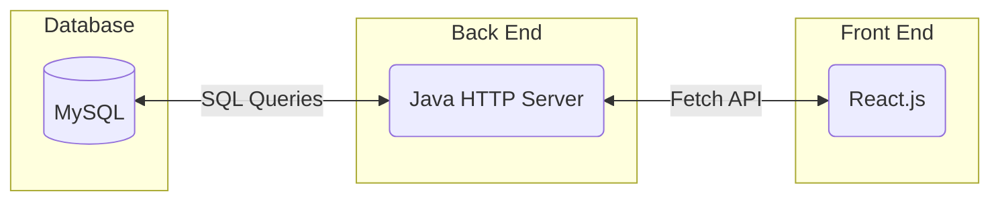
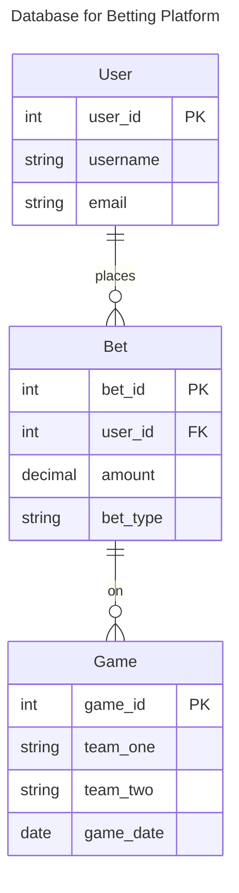
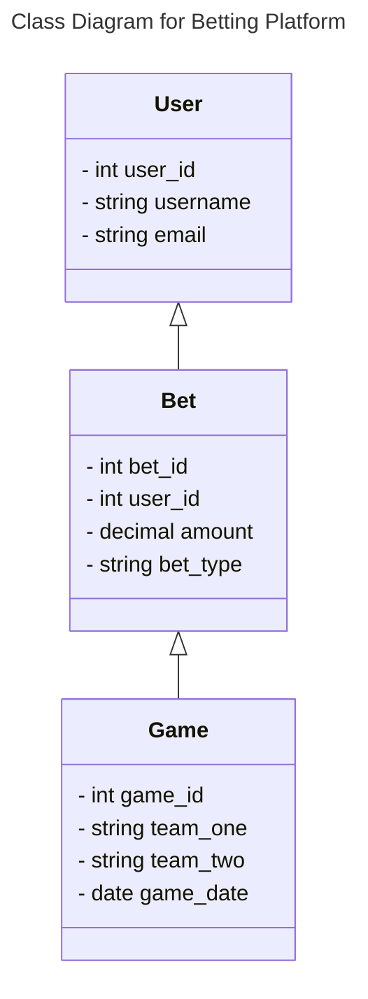
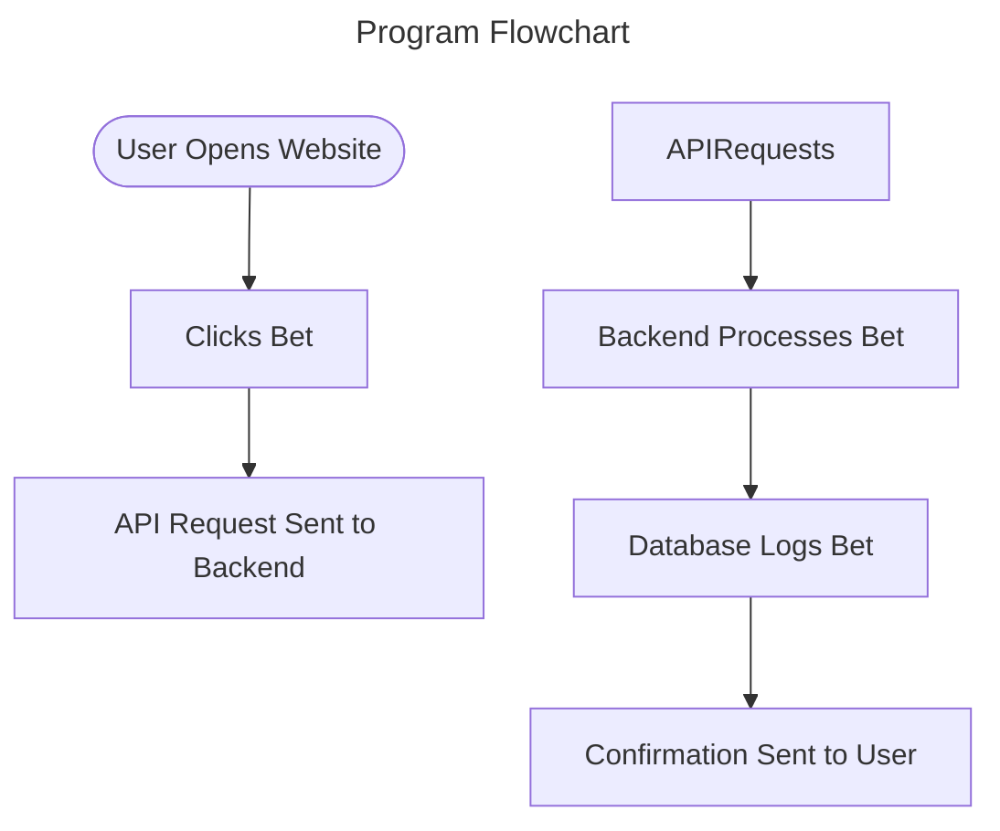
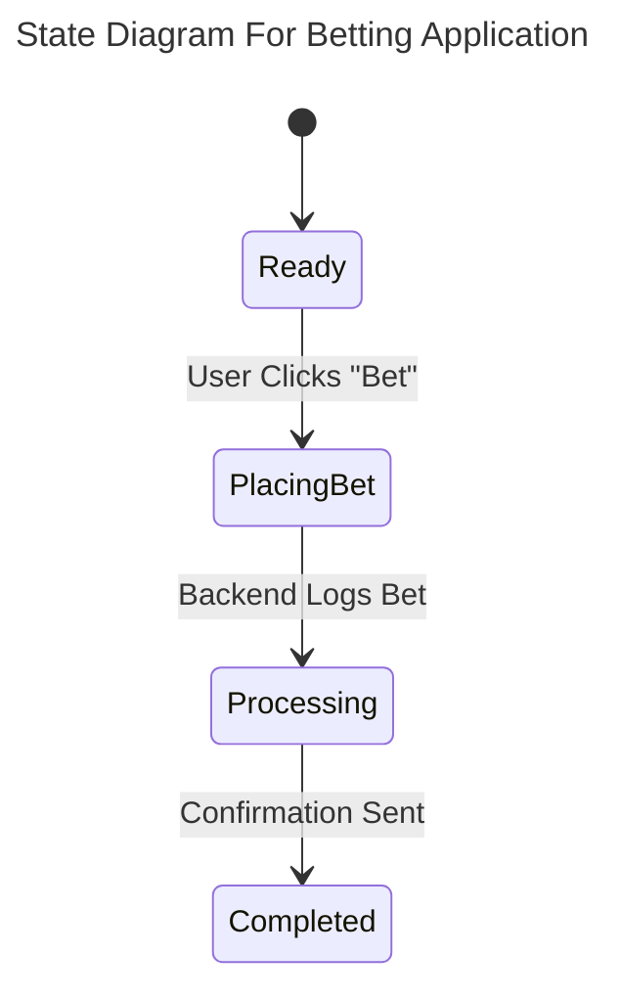
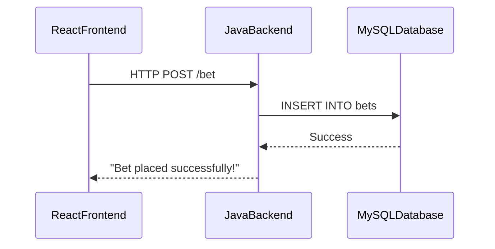

# Specification Document

This document serves as a living reference for the March Madness Betting Platform. It will be updated regularly to reflect changes in project architecture, specifications, and development decisions.

## One-Click Demo (no setup)

Click to launch a GitHub Codespace that builds and runs the full stack:

After the Codespace starts, open the **Ports** panel and click the forwarded web port to view the app.

### Project Abstract

The March Madness Betting Platform allows users to place bets on March Madness games through an interface. The system consists of a frontend built in React.js, a backend using a plain Java HTTP server, and a MySQL database to store betting data. Users interact with the interface to place bets, which are logged in the database for tracking. Future enhancements includes authentication, game tracking, and additional betting features.

### Customer

This software is designed for:
- *Casual March Madness fans* who want to participate in friendly betting.
- *Betting enthusiasts* looking for an easy and lightweight platform to use.
- *Instructional staff from CS506*

### Specification

#### Technology Stack

#### Database

#### Class Diagram

#### Flowchart

#### Behavior

#### Sequence Diagram

### Standards & Conventions

<!--This is a link to a seperate coding conventions document / style guide-->
[Style Guide & Conventions](STYLE.md)
